  
  
  
  
  
  

  

# 🌐 Awesome Network Design Platform

> **A Curated Ecosystem of Enterprise SaaS Products & Open-Source Optimization Repositories**  
> *Focused on Supply Chain Network Design, Facility Location Modeling, Multi-Echelon Flow Optimization, Discrete-Event Simulation, Digital Twins, and Strategic Network Planning.*

---

## 📌 Overview & Key Concepts

**Supply Chain Network Design (SCND)** empowers organizations to establish optimal facility locations (warehouses, plants, distribution centers), assign optimal product flows, minimize logistics & carbon emissions costs, and evaluate multi-echelon risk scenarios. 

This repository provides an authoritative guide comparing **commercial SaaS supply chain platforms** and **open-source operations research (OR) & simulation tools**.

---

## 📑 Table of Contents

- [🏢 SaaS & Commercial Platforms](#-saas--commercial-platforms)
- [🔬 Open-Source GitHub Projects](#-open-source-github-projects)
- [💡 Frameworks for Building Custom Systems](#-frameworks-for-building-custom-systems)
- [🤝 How to Contribute](#-how-to-contribute)
- [💖 Support & Community](#-support--community)
- [📈 Star History](#-star-history)
- [📜 Disclaimer](#-disclaimer)

---

## 🏢 SaaS & Commercial Platforms

> 📊 **Market Insights**: The global Supply Chain Network Design & Optimization software market is estimated at **$6.2 Billion USD** (2026) and is expanding at an estimated **11.5% CAGR**. The sector is **moderately concentrated**, dominated by enterprise suites (Dassault Systèmes, Coupa, Blue Yonder) for end-to-end global supply chains, while nimble cloud-native innovators (Optilogic, anyLogistix) capture growing market share through rapid AI modeling and digital twins.

Below is a comparative matrix of commercial platforms, sorted by **Company Size / Valuation (Descending)**:

| Product & Website | Key Capabilities & Description | Starting Price | Free Tier / Trial Limits | Company Size (Valuation / Revenue) |
| :--- | :--- | :--- | :--- | :--- |
| **[Dassault Systèmes 3DEXPERIENCE](https://www.3ds.com/)** 🏭 | Comprehensive digital twin platform supporting multi-echelon network topology, factory layout, and end-to-end supply chain operational modeling. | ~$35,000 / year (Enterprise User Tier) | 14-Day 3DEXPERIENCE Cloud Trial (Max 5 models, basic app suite) | **$45.0B Valuation** ($6.1B Annual Revenue) |
| **[Coupa Supply Chain Design](https://www.coupa.com/products/supply-chain-design/)** 🌐 | Market-leading enterprise platform (formerly LLamasoft Supply Chain Guru) for strategic network optimization, carbon footprint tracking, and risk simulation. | ~$2,500 / month ($30,000 / year base module) | 14-Day Guided Sandbox Proof-of-Concept Trial (Request-based; 0 self-serve days) | **$8.0B Valuation** ($1.0B ARR) |
| **[Blue Yonder Network Design](https://blueyonder.com/)** 🚚 | Strategic network design suite integrating multi-echelon inventory planning, transport optimization, and AI scenario exploration. | ~$50,000 / year (Base Enterprise License) | 30-Day Enterprise Evaluation Sandbox (Sales approval required) | **$7.1B Valuation** ($1.3B Annual Revenue) |
| **[ToolsGroup](https://www.toolsgroup.com/)** ⚡ | AI-driven supply chain planning software providing inventory optimization, demand sensing, and multi-tier network planning. | ~$30,000 / year (Standard Tier) | 14-Day Request-Based Interactive Demo Sandbox | **$300M Valuation** ($100M ARR) |
| **[Logility](https://www.logility.com/)** 📦 | Digital supply chain platform providing strategic facility capacity modeling, distribution routing, and operational flow design. | ~$25,000 / year (Base Platform License) | 14-Day Guided Sandbox Trial (Available upon request) | **$250M Valuation** ($100M Annual Revenue) |
| **[Optilogic Cosmic Frog](https://optilogic.com/)** 🐸 | Cloud-native network design platform featuring rapid solver runs, discrete-event simulation, greenfield engine, and AI scenario evaluation. | ~$950 / month ($11,400 / year Standard Tier) | **Free Forever Developer License** (100 solver mins/mo, 1GB cloud storage) | **$53M Funding** ($16.5M ARR) |
| **[GAINS Supply Chain](https://gainsystems.com/)** 🎯 | Performance optimization suite covering strategic facility location, inventory allocation, and multi-echelon network planning. | ~$20,000 / year (Base Module) | 14-Day Interactive Trial Environment (On sales request) | **$50M Valuation** ($35M Annual Revenue) |
| **[anyLogistix](https://www.anylogistix.com/)** 📈 | Supply chain design software combining CPLEX/ALX optimization engines with AnyLogic discrete-event simulation. | ~$20,000 / year (or $55,000 Perpetual License) | **Free Forever Personal Learning Edition (PLE)** (Max 10 DCs/factories, 100 orders, single thread) | **Private Entity** ($23.4M ARR) |
| **[CAST Aurora](https://www.castsoftware.com/)** 🗺️ | Specialist network modeling tool focused on facility location, geographic customer-to-DC allocation, and transport cost reduction. | ~$15,000 / year (Per Planner License) | 14-Day Evaluation License (Includes sample network datasets) | **Private Entity** ($20M Annual Revenue) |

---

## 🔬 Open-Source GitHub Projects

Open-source tools center on mathematical optimization (MILP/LP solvers), graph analytics, discrete-event simulation, and geospatial data processing.

Below are top open-source projects, sorted by **GitHub Star Count (Descending)**:

1. **[Google OR-Tools](https://github.com/google/or-tools)**  🛠️  
   Fast, portable software suite for combinatorial optimization problems including vehicle routing (VRP), facility location, flow networks, and integer programming (MILP).

2. **[NetworkX](https://github.com/networkx/networkx)**  🕸️  
   Python package for the creation, manipulation, and study of complex networks, shortest paths, transshipment topology, and graph algorithms.

3. **[OSMnx](https://github.com/gboeing/osmnx)**  🗺️  
   Python library to download, model, analyze, and visualize spatial network data from OpenStreetMap for geographic supply chain routing & distance matrices.

4. **[PuLP](https://github.com/coin-or/pulp)**  🐍  
   Popular open-source LP/MILP solver interface written in Python, widely used for facility location models, transshipment problems, and capacity allocation formulations.

5. **[SimPy](https://github.com/simpy/simpy)**  ⏱️  
   Process-based discrete-event simulation framework in Python ideal for modeling inventory dynamics, warehouse operations, and supply network lead times.

6. **[Pyomo](https://github.com/Pyomo/pyomo)**  📐  
   Comprehensive Python-based mathematical modeling language (AML) supporting linear programming, mixed-integer programming, and stochastic network optimization.

7. **[JuMP.jl](https://github.com/jump-dev/JuMP.jl)**  🚀  
   High-performance modeling language for mathematical optimization in Julia, designed for large-scale enterprise network optimization and facility location.

8. **[PySCIPOpt](https://github.com/scipopt/PySCIPOpt)**  ⚡  
   Python interface for the SCIP Optimization Suite, one of the fastest non-commercial solvers for mixed-integer programming and constraint integer programming.

9. **[COIN-OR Cbc](https://github.com/coin-or/Cbc)**  ⚙️  
   Open-source mixed integer programming solver written in C++, used as the default backend solver for PuLP, Pyomo, and network design prototypes.

10. **[SupplyNetPy](https://github.com/SupplyChainSimulation/SupplyNetPy)**  📦  
    Python library for discrete-event simulation, inventory planning, and optimization of supply chain networks built on top of SimPy.

---

## 💡 Frameworks for Building Custom Systems

While proprietary commercial platforms provide turnkey scenario managers and ERP connectors, open-source building blocks excel in custom algorithm prototyping:

- 🔄 **Simulation + Optimization Loops**: Combine SimPy or SupplyNetPy discrete-event simulation with PuLP / OR-Tools solvers to evaluate dynamic disruption scenarios.
- 🏭 **LP/MILP Facility Location**: Formulate p-median, fixed-charge location, and multi-echelon transshipment models using Pyomo or JuMP.jl.
- 🧬 **Meta-Heuristics**: Leverage genetic algorithms, simulated annealing, or tabu search for hyper-large combinatorial routing & location problems.
- 🌍 **Geospatial & Distance Matrices**: Integrate OSMnx and GIS libraries to compute exact driving distances and transit times between supply nodes.

---

## 🤝 How to Contribute

Contributions are warmly welcomed! To contribute:

1. Fork this repository.
2. Add or update entries in `README.md` following the table or list schema.
3. Ensure links, pricing, free trial limits, and company details are factual and up-to-date.
4. Submit a Pull Request (PR) with a brief description of changes.

For curated awesome lists standards, check out [Awesome-Awesome-Awesome](https://github.com/ishandutta2007/Awesome-Awesome-Awesome).

---

## 💖 Support & Community

Thank you for exploring the **Awesome Network Design Platform** repository! If you find this curated ecosystem list helpful for your supply chain modeling, optimization, or business planning needs, please consider supporting the project:

- ⭐ **Star this repository** to help others discover it.
- 🔀 **Fork and Contribute** by adding new platforms, solvers, or research projects.
- 📢 **Share** with colleagues and network design professionals.
- ☕ **Buy Me a Coffee**: Support ongoing maintenance and curation on the [GitHub Sponsor Dashboard](https://github.com/sponsors/ishandutta2007).

  

---

## 📈 Star History

---

## 📜 Disclaimer

- This is a **community-curated list** — provided for informational and educational purposes only.
- Supply chain network decisions involve significant capital expenditures. Always validate model outputs, cost parameters, and capacity constraints before executing strategic network restructuring.
- All product names, logos, and brands are property of their respective owners.

---

  <b>Built for Supply Chain Strategists, Network Designers, Operations Researchers, and Logistics Engineers 🚀</b>

